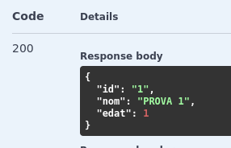
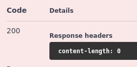

### Treball fet per: Yeray Reyes ( https://github.com/ziccur/ )

# Millores i preguntes de reflexió

## Afegiu un endpoint que cerqui per un camp de tipus String on feu servir regex. Afegiu el
que calgui al servei, repositori, etc.

En el meu cas he afegit un endpoint que busca per el nom de l'animal amb regex. Per fer-ho he afegit un nou mètode a l'interface `AnimalRepos`. També l'he afegit al seu correspondent servei: `AnimalService`. A més, he afegit un nou endpoint al controlador `AnimalController` que permet fer cerques per nom d'animal amb regex, aquest es diu `searchAnimalsByName` i al swagger apareix com `/api/v1/animals/search`.

## Què caracteritza una api reactiva com aquesta i què la fa diferent d’una api síncrona amb
MVC com les treballades anteriorment?

La diferencia és que una API reactiva gestiona peticions de forma asíncrona i no bloquejant amb Flux/Mono, permetent alta concurrència. Una API síncrona bloqueja fils per cada petició, limitant recursos i rendiment. Com es va explicar a classe amb les asyncrones si tenim molts clients alhora podem donar serveis a tots ells alhora.

## Què signifiquen Mono i Flux? Per a què penseu que serveixen i per què són útils en aquest
tipus de programació?

Com s'explica en el PDF Mono es una classe que ens permet guardar valors, el problema es que només podem guardar 0 o 1 de la classe que li hem indicat. Per aixo tenim Flux que ens permet guardar més d'un de la classe que l'indiquem. Exemples que he usat a la classe `AnimalController`: 
    -   Mono: per getters d'un unic registe com `/api/v1/animals/{id}`
    -   Flux: per getters amb múltiples registre com: `/api/v1/animals/all`

## Què és record? Un record utilitza getters i setters? Justifiqueu la resposta

Un record és una classe Java immutable que defineix dades de forma concisa. No utilitza setters perquè és immutable. Els getters són implicits, però sense el prefix "get". Això garanteix que les dades no es modifiquin després de la creació. Així doncs un recod no té ni usa setters i no cal que generis getters ja que aquests son implicits i els pots consultar de manera predeterminada.

# PROVES AMB SWAGGER

## POST: /api/v1/animals/save

El save demana les següents dades: 
```
    {
        "id": "1",
        "nom": "PROVA 1",
        "edat": 1
    }
```

Imatges de swagger


Imatge de Terminal


## GET: /api/v1/animals/{id}

Aquest GET només necesita una dada per buscar el registre: `Id`

Aquests son els registres que torna: 




## GET: /api/v1/animals/all

Aquest métode GET torna tots els registres per tant no necesita cap entrada, per tal de fer-ho mes dinamic he introduit un registre més manualment i com veiem els torna tots:


## GET: /api/v1/animals/search

Aquest métode es propi i es per buscar registres per el nom amb regex, per demostar-go ensenyare diversos casos:

En el primer cas buscarem noms que acabin per 2:


En el següent cas buscarem a tots els noms que acabin amb un número:


## PUT: /api/v1/animals/update

Aquest métode ens permet actualitzar registres indicant la id del registre, en aquest cas li canviarem el nom al registre 1:

Prova per swagger


Prova per terminal


## DELETE: /api/v1/animals/{id}

Aquest endpoint elimina el nostre registre buscantlo per la id que li indiquem, ho probarem amb el nostre registre amb id 1:

Proves per swagger:




Prova per terminal


